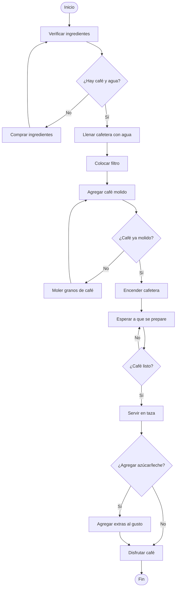

# Proceso para preparar café

## Diagrama de flujo

```mermaid
flowchart TD
    A([Inicio]) --> B[Verificar ingredientes]
    B --> C{¿Hay café y agua?}
    C -->|No| D[Comprar ingredientes]
    D --> B
    C -->|Sí| E[Llenar cafetera con agua]
    E --> F[Colocar filtro]
    F --> G[Agregar café molido]
    G --> H{¿Café ya molido?}
    H -->|No| I[Moler granos de café]
    I --> G
    H -->|Sí| J[Encender cafetera]
    J --> K[Esperar a que se prepare]
    K --> L{¿Café listo?}
    L -->|No| K
    L -->|Sí| M[Servir en taza]
    M --> N{¿Agregar azúcar/leche?}
    N -->|Sí| O[Agregar extras al gusto]
    N -->|No| P[Disfrutar café]
    O --> P
    P --> Q([Fin])
```

